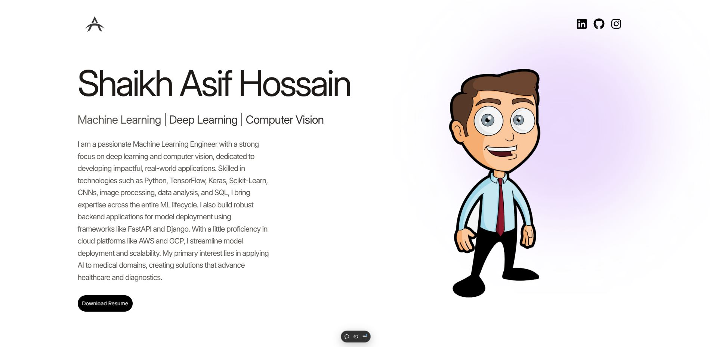
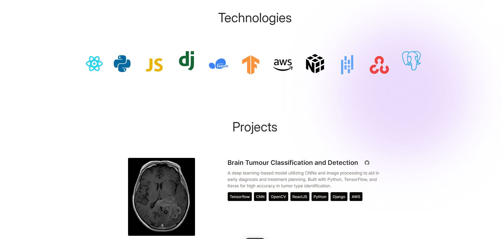
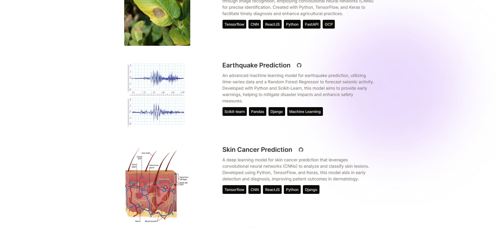
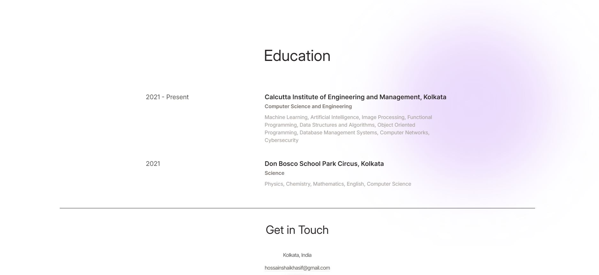

# 🌟 Portfolio Website 🌟

Welcome to my Portfolio Website! This project is built with React and styled with Tailwind CSS to showcase my skills, projects, and contact information in a modern, visually appealing way.

## 🚀 Demo

Check out the live version here 👉 [Live Demo](https://portfolio-website-umber-gamma.vercel.app/)

## 🎨 Features

 #### ✨ Responsive Design: Perfectly optimized for mobile, tablet, and desktop viewing.
 #### 💻 Modern UI: Clean, minimal, and stylish layout using Tailwind CSS.
 #### 🖱️ Smooth Navigation: Scrolls seamlessly between sections.
 #### 🛠️ Project Showcase: Displays projects with links to GitHub and live demos.
 #### 📬 Contact Form: Built-in form to get in touch directly.

## 🖼️ Screenshots









## 🛠️ Installation

1. Clone the repository:
   ```
   git clone https://github.com/your-username/portfolio-website.git
   ```

2. Navigate to the project directory:
   ```
   cd portfolio-website
   ```

3. Install dependencies:
   ```
   npm install
   ```

## 🎯 Usage

Start the development server:
```
npm run dev
```

## 🛠️ Technologies Used

1. React ⚛️: JavaScript library for building the user interface.
2. Tailwind CSS 🎨: Utility-first CSS framework for styling.
3. JavaScript (ES6+) 📝: Core language for interactive functionality.
4. HTML5 & CSS3 🌐: Structure and styling of the website.

## 📜 License
This project is open-source and available under the MIT License 📄.


